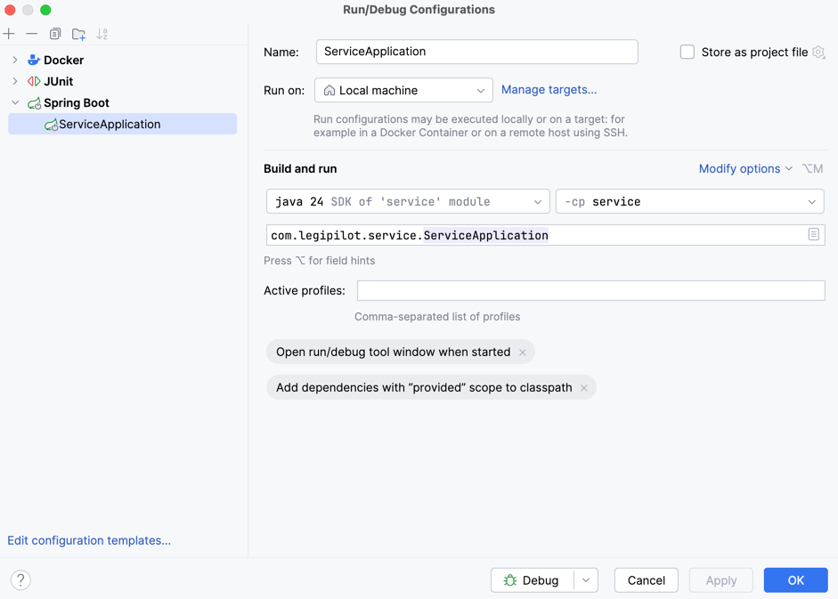

# Legipilot

SaaS qui permet de piloter vos ressources humaines de l’embauche à la fin du contrat de travail et garantissez votre conformité juridique.


### Stack

- Front-end, application web: Next.js / TypeScript
- Back-end, service avec les règles métiers: Spring boot / Java 24
- Base de données : Postgres, S3
- IA: Mistral AI
- Hébergement : Scaleway
- Mailing : Brevo

### Lancement du projet

**Docker**

```bash
docker compose up
```

**Front**

```bash
cd web-app
npm run build && npm run dev
```

**Back**

Lancement avec IntelliJ :



### Deployment

Every information about deployment are in [this documentation](./infra/scaleway/deploy-documentation.md). Also, you can check [this short video](https://atrian126-my.sharepoint.com/personal/marin_desurirey_atrian_fr/_layouts/15/stream.aspx?id=%2Fpersonal%2Fmarin%5Fdesurirey%5Fatrian%5Ffr%2FDocuments%2FLEGIPILOT%2FTECH%20PRODUIT%2FDesign%20visuel%2FPartage%20docs%20Steeve%20et%20Gabin%2F05%20%2D%20Tech%2Fd%C3%A9ploiement%2Emov&referrer=StreamWebApp%2EWeb&referrerScenario=AddressBarCopied%2Eview%2E2e74ba4f%2D95c9%2D44ca%2Db81d%2Dd3ccc38cfbf1).

### Todo

 - Sécurisation des endpoints
 - Testing sur les grosses actions fonctionnelles
 - [Document de suivi](https://atrian126-my.sharepoint.com/:w:/r/personal/marin_desurirey_atrian_fr/_layouts/15/Doc.aspx?sourcedoc=%7B31184494-5ED5-4836-A32A-B77FD5CDC729%7D&file=Retours%20dev.docx&action=default&mobileredirect=true)

### Useful links

- [Legipilot](https://www.legipilot.com)
- [GitHub](https://github.com/legipilot)
- [Used icons : heroicons](https://heroicons.com/)
- [Flag library, selection with flags](https://www.npmjs.com/package/react-flags-select)